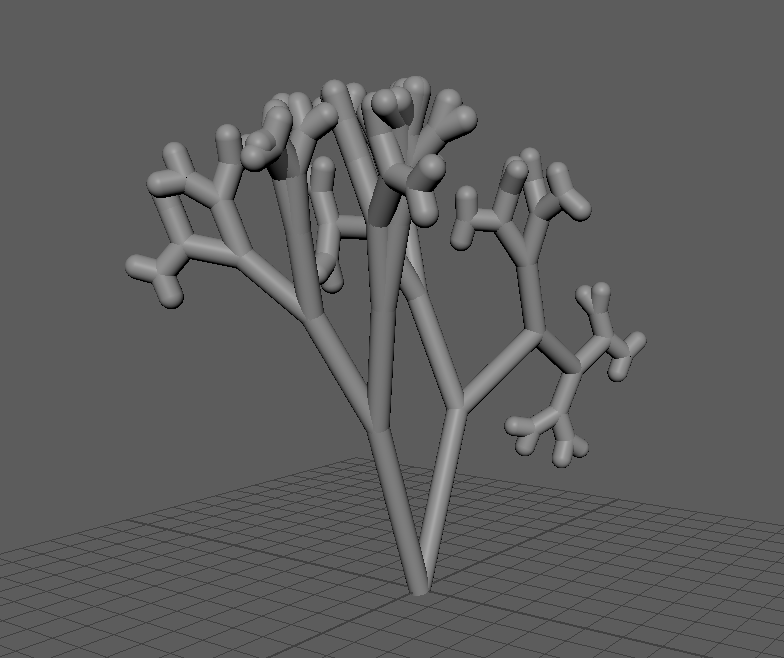

# Scripts for Maya infinite staircase assignment

I have created three scripts for this assignment:
- `makeStairs.mel` is my first script which generates the staircase.
- `setCamera.mel` to store the parameters of the camera that make my staircase illusion work. This one is just a tiny one to make sure I don't lose those values.
- `coral_builder.py` generates a variety of corals depending on the multiple parameters.

## `makeStairs.mel` and `setCamera.mel`

To run, just add to the `MayaScripts` folder and source the files. `makeStairs` will generate an staircase geometry. Following it up by `setCamera` will set the perspective camera view in a way that the staircase looks infinite.

These are the first scripts I've made for the project so they are a bit clunky especially since they use mel. I did improve with the next one though.

## `coral_builder.py`

  

Has a dependency on `numpy` library. To run just do the usual procedure for a python script.

Running it as is will result in 4 different corals being generated. In the interest of time I have not implemented a UI so to change parameters edit them in the end of the script under "execute" section.
In the same section you will find the commented out `for` loops generating all the corals I've used for my animation. This is another reason I haven't created the UI, as this was a much simpler, more practical solution for me to use on this project.

For depth parameter, I would suggest being aware of going too far as I use recursion so adding each level slows down the generation process exponentially. I've personally found no practical need to go above depth 7. I did test it with depth 10 on a lab machine which took a minutes and resulted in a nice broccoli looking structure.
